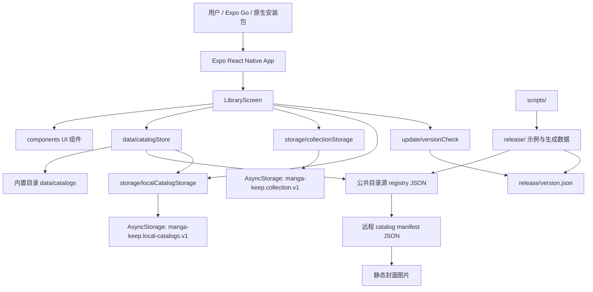
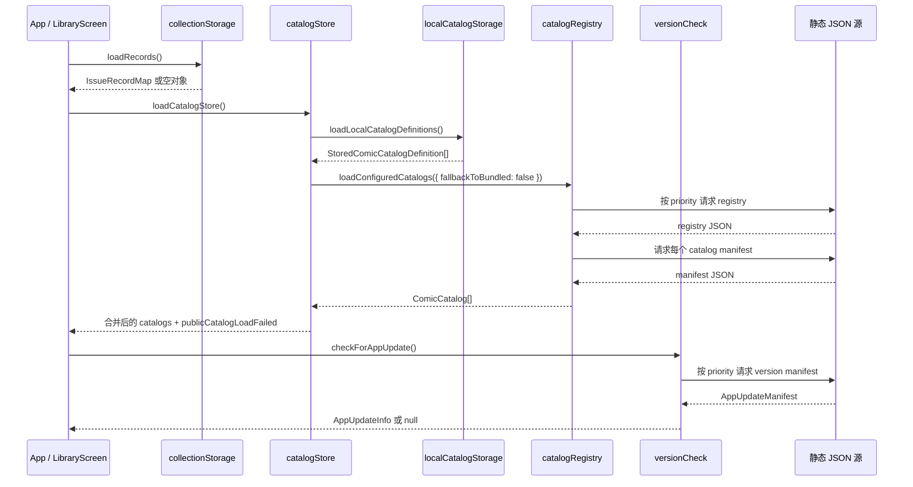

# 技术设计架构

本文档基于当前代码和配置说明 `manga-keep` 的技术架构。它面向后续
开发者，重点解释移动端运行时如何加载漫画目录、保存本地收藏、导入导出
数据、检查应用更新，以及如何通过静态文件完成无服务器发布。

## 架构结论

当前项目是一个单包 Expo 移动应用，业务核心集中在 `mobile/src`。应用不
依赖后端服务，公共目录、封面和版本更新信息都通过静态 JSON 与静态资源
分发；用户的收藏状态和本地自建目录保存在设备本地 AsyncStorage。

整体架构如下：



运行时没有路由层和全局状态库。`mobile/App.tsx` 直接渲染
`LibraryScreen`，`LibraryScreen` 用 React state 与 effects 协调目录、
收藏记录、弹窗、筛选、搜索、批量操作和更新提示。这个设计简单直接，适合
当前单屏工具型应用。

## 技术栈

项目的移动端配置位于 `mobile/package.json`、`mobile/app.json`、
`mobile/tsconfig.json` 和 `mobile/eas.json`。

- 应用框架：Expo `~54.0.33`，入口是 `mobile/index.ts`，通过
  `registerRootComponent(App)` 注册根组件。
- UI 框架：React `19.1.0`、React Native `0.81.5`、React Native Web
  `^0.21.0`。Web 预览通过 `npm run web` 或 Expo web 支持。
- 语言与类型：TypeScript `~5.9.2`，`mobile/tsconfig.json` 开启
  `strict: true`。
- 本地存储：`@react-native-async-storage/async-storage` `2.2.0`，用于
  收藏记录和本地目录定义。
- 图标：`@expo/vector-icons`，当前 UI 主要使用 `MaterialCommunityIcons`。
- Expo 配置：应用名为「漫集」，包名为
  `com.mangakeep.app`，版本为 `1.0.1`，iOS `buildNumber` 与 Android
  `versionCode` 均为 `2`，开启 `newArchEnabled`。
- 测试工具：`tsx --test "src/**/*.test.ts"` 使用 Node 内置 test runner
  执行 TypeScript 单元测试。
- 类型检查：`tsc --noEmit`。
- 构建发布：支持 EAS `preview` / `production` APK 构建；同时有 GitHub
  Actions 工作流通过 `expo prebuild` 生成 Android release APK 和未签名
  iOS IPA。

`mobile/app.json` 的 `extra` 是运行时远程配置入口。当前配置了两类源：

- `catalogSources`：公共漫画目录注册表源，按 `priority` 从 Gitee 到
  GitHub 兜底。
- `updateManifestSources`：应用版本清单源，按 `priority` 从 Gitee 到
  GitHub 兜底。

代码会过滤包含 `YOUR_NAME` 等占位符的地址，因此模板配置在
开发期不会触发无效远程请求。

## 目录结构与职责

项目结构按移动端、脚本、发布数据和文档拆分。主要职责如下：

```text
manga-keep/
  mobile/
    App.tsx
    index.ts
    app.json
    eas.json
    package.json
    src/
      components/
      data/
      screens/
      storage/
      styles/
      update/
      types.ts
  scripts/
  release/
  docs/
```

`mobile/index.ts` 是 Expo 注册入口。`mobile/App.tsx` 是应用根组件，它只
挂载 `LibraryScreen` 和深色状态栏。

`mobile/src/screens/LibraryScreen.tsx` 是当前唯一业务屏幕。它负责：

- 启动时加载收藏记录、目录列表和版本更新信息。
- 管理当前目录、筛选条件、搜索关键字、网格列数、批量模式和选中期刊。
- 计算完成率、已拥有数量、缺本数量和想要数量。
- 调用存储层保存收藏记录和本地目录。
- 控制工具弹窗、目录编辑弹窗、期刊详情弹窗和更新提示弹窗。

`mobile/src/components` 是 UI 组件层。组件基本保持展示与交互输入职责：

- `IssueCard` 展示单期期刊卡片和收藏状态。
- `IssueDetailModal` 编辑单期收藏状态、品相和备注。
- `CatalogSwitcher` 切换目录。
- `ToolsModal` 承载目录和收藏的导入导出操作。
- `LocalCatalogEditorModal` 创建本地目录定义。
- `UpdatePromptModal` 展示应用更新并打开平台对应链接。
- `SegmentedControl`、`MascotSticker`、`AnimatedMangaDecor` 提供通用控件和
  视觉元素。

`mobile/src/data` 是目录数据层。它负责把不同来源的数据统一成
`ComicCatalog` 和 `ComicIssue`：

- `catalogs.ts` 定义内置默认目录「知音漫客」。
- `defaultCatalogConstants.ts` 定义默认目录 ID、名称和总期数，当前总期数
  是 `704`。
- `coverSources.generated.ts` 映射内置封面文件到 React Native
  `require(...)` 资源。
- `catalogHelpers.ts` 提供期号格式化、key 生成、封面规则展开和目录构建。
- `catalogRegistry.ts` 读取远程注册表和远程目录 manifest，做 URL 解析、
  schema 校验、重定向处理和 fallback。
- `catalogStore.ts` 组合本地目录、公共目录和内置目录，并按来源排序。

`mobile/src/storage` 是本地持久化层：

- `collectionStorage.ts` 读写收藏记录，AsyncStorage key 是
  `manga-keep.collection.v1`。
- `localCatalogStorage.ts` 读写本地目录定义，AsyncStorage key 是
  `manga-keep.local-catalogs.v1`。

`mobile/src/update` 是更新检测层。`versionCheck.ts` 读取 Expo 配置中的
版本清单源，请求 `release/version.json` 风格的静态 JSON，比对当前
`expo.version` 与远端 `latestVersion`，并生成更新弹窗需要的
`AppUpdateInfo`。

`scripts/` 是开发和发布数据辅助脚本：

- `extract-covers.py` 从 PDF 或 ZIP 中抽取首页封面到 `mobile/assets/covers`。
- `generate-remote-catalog-manifest.mjs` 扫描本地封面并生成远程目录
  manifest 到 `release/catalogs/zhiyin-manke/manifest.generated.json`。
- `generate-ui-assets.py` 用 PIL 生成当前 UI 使用的贴纸 PNG。

`release/` 存放可发布静态数据示例：

- `version.example.json` 是应用更新清单示例。
- `catalog-registry.example.json` 是公共目录注册表示例。
- `catalog-registry-redirect.example.json` 是注册表迁移重定向示例。
- `release/catalogs/zhiyin-manke/` 存放目录 manifest 示例和生成结果。

`docs/` 存放面向维护者的说明文档。现有文档已经覆盖远程目录数据设计与
发布更新流程，本文件补齐整体架构视角。

## 运行时数据流

应用启动时会并行触发本地收藏加载、目录加载和更新检测。目录加载和更新
检测都是 best-effort：远程源失败不会阻塞用户打开本地收藏功能。



### App 启动

`mobile/index.ts` 注册 `App`，`mobile/App.tsx` 渲染 `LibraryScreen`。
`LibraryScreen` 的初始化状态包含内置 `defaultCatalog`，因此即使
AsyncStorage 或网络还没有返回，界面也有可展示的默认目录。

启动后的三个主要 effect 是：

1. 调用 `loadRecords()` 加载本地收藏记录。
2. 调用 `loadCatalogStore()` 加载公共目录和本地目录。
3. 调用 `checkForAppUpdate()` 检查应用版本清单。

### 目录加载

`loadCatalogStore()` 先尝试读取本地目录定义，再尝试读取公共目录。公共目录
通过 `loadConfiguredCatalogs({ fallbackToBundled: false })` 加载，这意味着
`catalogStore` 自己负责公共目录失败后的兜底策略。

目录合并逻辑在 `mergeCatalogLists()` 中：

- 先写入内置目录。
- 再写入公共远程目录。
- 最后写入本地目录。

同 ID 目录后写入的会覆盖先写入的，所以实际优先级是本地目录高于公共目录，
公共目录高于内置目录。最终展示排序按来源排列：本地目录、远程目录、内置
目录；同来源内按中文名称排序。

当公共目录请求失败时，`loadCatalogStore()` 返回：

- `catalogs`：本地目录加内置默认目录。
- `publicCatalogLoadFailed: true`：界面显示「公共目录暂时不可用」提示。

如果没有配置真实公共目录源，且没有本地目录，应用会展示内置默认目录。

### 公共源 fallback

`catalogRegistry.ts` 从 `expo.extra.catalogSources` 读取公共目录源，过滤占位
地址后按 `priority` 排序。`fetchRemoteCatalogsFromSources()` 逐个尝试源：

1. 请求 `registryUrl`。
2. 校验 `RemoteComicCatalogRegistry`。
3. 如果存在 `redirectUrl`，基于当前注册表地址解析并继续请求，最多跟随
   3 次。
4. 对注册表里的每个 `manifestUrl` 请求目录 manifest。
5. 校验 `RemoteComicCatalogManifest` 并转换为 `ComicCatalog`。

某个源失败后会尝试下一个源。所有源失败时抛出最后一个错误，由
`catalogStore` 兜底到内置目录。

### 本地目录合并

本地目录来自 `localCatalogStorage.ts`。用户通过
`LocalCatalogEditorModal` 输入 ID、名称、短名称、类型、总期数、补零位数和
封面 URL 规则；`catalogDefinitionFromInput()` 校验并生成
`StoredComicCatalogDefinition`。

保存时 `upsertLocalCatalogDefinition()` 会按 `id` 覆盖或追加，并更新
`updatedAt`。运行中，`LibraryScreen` 还维护
`sessionLocalCatalogsRef`，确保刚导入或创建的目录立刻出现在当前页面，不
必等待下一次完整加载。

### 收藏记录读写

收藏记录是 `IssueRecordMap`，key 为 `catalogId:issueNumber`，例如
`zhiyin-manke:128`。这使收藏状态与远程 URL 解耦：远程 JSON 和封面迁移后，
只要目录 ID 与期号不变，用户记录仍然有效。

`collectionStorage.ts` 的关键行为是：

- `loadRecords()` 从 AsyncStorage 读取 JSON，解析失败时返回空对象。
- `normalizeRecordMap()` 只保留 `catalogId:issueNumber` 形式的限定 key；旧
  格式数字收藏记录不会迁移为默认目录记录。
- `mergeRecord()` 合并单期状态并刷新 `updatedAt`。
- `saveRecords()` 写回 AsyncStorage。
- `normalizeStatus()` 保证「已有」状态有默认品相，非「已有」状态重置为
  `ungraded`。

`LibraryScreen` 的 `persist()` 会先更新 React state，再异步保存；保存失败
时弹出提示。

### 导入导出

导入导出都通过 `ToolsModal` 的文本框完成，没有文件系统依赖。

收藏导出由 `exportRecords()` 生成：

```json
{
  "app": "manga-keep",
  "version": 2,
  "exportedAt": "2026-05-25T00:00:00.000Z",
  "records": {}
}
```

收藏导入由 `parseImportedRecords()` 处理。它既接受完整导出对象，也接受
裸 `IssueRecordMap`。解析后会执行同一套 key 和 record 校验。

本地目录导出由 `exportCatalogDefinition()` 生成：

```json
{
  "app": "manga-keep",
  "type": "catalog-definition",
  "version": 1,
  "exportedAt": "2026-05-25T00:00:00.000Z",
  "catalog": {}
}
```

本地目录导入由 `parseImportedCatalogDefinition()` 处理。它接受完整导出对象
或裸 `StoredComicCatalogDefinition`，校验通过后调用
`upsertLocalCatalogDefinition()` 保存到本机。

### 更新检测

`checkForAppUpdate()` 默认从 `expo.extra.updateManifestSources` 获取版本清单
源。它按优先级逐个请求，所有源失败时返回 `null`，不会阻塞应用使用。

成功获取清单后，`createUpdateInfo()` 会比较：

- 当前版本：`expo.version`，当前配置是 `1.0.1`。
- 最新版本：远程 `latestVersion`。
- 最低可用版本：远程 `minimumVersion`，可选。

当 `latestVersion` 高于当前版本时返回 `AppUpdateInfo`。如果
`minimumVersion` 高于当前版本，`forceUpdate` 为 `true`，更新弹窗不可通过
返回请求关闭。`UpdatePromptModal` 打开链接时优先使用 `updatePageUrl`，再
按平台选择 Android 或 iOS 链接，最后回退到旧字段。

## 数据模型

核心类型集中在 `mobile/src/types.ts` 和 `mobile/src/update/versionCheck.ts`。
这些类型是目录、期刊、本地存储和更新清单之间的契约。

### ComicCatalog

`ComicCatalog` 是运行时目录对象：

```ts
type ComicCatalog = {
  id: string;
  name: string;
  shortName: string;
  kind: ComicCatalogKind;
  description?: string;
  issueCount: number;
  numberPadding: number;
  source: ComicCatalogSource;
  issues: ComicIssue[];
};
```

`source` 标记目录来源：

- `bundled`：内置在包内的默认目录。
- `remote`：来自远程 manifest，包含 `manifestUrl` 和可选 `sourceId`。
- `local`：来自本地自建或导入目录，包含原始 `definition`。

### ComicIssue

`ComicIssue` 是单期期刊对象：

```ts
type ComicIssue = {
  key: ComicIssueKey;
  catalogId: string;
  number: number;
  sortNumber: number;
  label: string;
  displayTitle: string;
  coverUrl?: string;
  cover?: ImageSourcePropType;
};
```

`key` 的格式是 `` `${catalogId}:${number}` ``。内置封面使用 `cover` 本地
资源，远程和本地目录通常使用 `coverUrl`。

### IssueRecordMap

`IssueRecordMap` 是本地收藏记录：

```ts
type IssueRecord = {
  status: 'missing' | 'owned' | 'wishlist';
  condition: 'ungraded' | 'mint' | 'good' | 'worn' | 'duplicate';
  note: string;
  updatedAt: string;
};

type IssueRecordMap = Record<ComicIssueKey, IssueRecord>;
```

持久化位置是 AsyncStorage `manga-keep.collection.v1`。这个模型只保存用户
状态，不复制目录和期刊元数据。

### StoredComicCatalogDefinition

`StoredComicCatalogDefinition` 是用户本地目录定义：

```ts
type StoredComicCatalogDefinition = {
  schemaVersion: 1;
  id: string;
  name: string;
  shortName: string;
  kind: ComicCatalogKind;
  description?: string;
  issueCount: number;
  numberPadding: number;
  coverPattern?: string;
  createdAt: string;
  updatedAt: string;
};
```

持久化位置是 AsyncStorage `manga-keep.local-catalogs.v1`。运行时通过
`createCatalogFromDefinition()` 展开成完整 `ComicCatalog` 和 `ComicIssue[]`。
`coverPattern` 支持 `{number}` 和 `{padded}` 占位符。

### RemoteComicCatalogRegistry 与 RemoteComicCatalogManifest

公共目录由两层 JSON 组成：

- `RemoteComicCatalogRegistry`：入口注册表，包含 `schemaVersion`、
  可选 `redirectUrl` 和目录条目数组。
- `RemoteComicCatalogManifest`：单个目录 manifest，包含目录元数据、
  `issueCount`、可选 `coverBaseUrl`、可选 `coverPattern` 和可选逐期
  `issues` 覆盖。

远程 URL 可以是相对地址，代码会基于当前 JSON 地址解析成 HTTP 或 HTTPS
绝对地址。schema 校验失败会让该源失败并进入 fallback。

### AppUpdateManifest

`AppUpdateManifest` 定义在 `versionCheck.ts`：

```ts
type AppUpdateManifest = {
  latestVersion: string;
  minimumVersion?: string;
  title?: string;
  message?: string;
  updatePageUrl?: string;
  platforms?: {
    android?: { apkUrl?: string; storeUrl?: string };
    ios?: { testFlightUrl?: string; appStoreUrl?: string };
  };
  iosUrl?: string;
  androidUrl?: string;
  downloadUrl?: string;
  releaseNotesUrl?: string;
};
```

`AppUpdateInfo` 在 manifest 基础上增加 `currentVersion`、`forceUpdate` 和
可选 `sourceId`。更新弹窗只依赖这个聚合后的类型。

## 无服务器数据与更新方案

当前架构把服务端职责压缩为静态托管。应用只需要能通过 HTTP 或 HTTPS 获取
JSON 和图片，不需要 API 服务、数据库、登录系统或同步服务。

公共目录数据的静态链路是：

```text
mobile/app.json extra.catalogSources
  -> registry/index.v1.json
  -> catalogs/<catalog-id>/manifest.v1.json
  -> covers/<catalog-id>/<issue-cover>
```

应用更新的静态链路是：

```text
mobile/app.json extra.updateManifestSources
  -> release/version.json
  -> updatePageUrl / apkUrl / storeUrl / testFlightUrl / appStoreUrl
```

Gitee 和 GitHub 的兜底策略体现在两处：

- 目录源：`catalogSources` 可配置多个 registry，按 `priority` 尝试。
- 更新源：`updateManifestSources` 可配置多个 version manifest，按
  `priority` 尝试。

公共目录和应用更新都是远程可变数据；收藏记录和本地目录是设备私有数据。
因此，无服务器方案的关键约束是保持稳定 ID：

- 目录迁移时必须保持 `catalog.id` 不变。
- 期刊重命名或封面迁移时必须保持 `issue.number` 不变。
- 静态资源 URL 可以变，`catalogId:issueNumber` 不要变。

## 测试与验证

本项目是移动应用。涉及 app 行为、UI、导航、资源、发布配置或 Expo 配置的
变更，在完成前必须验证桌面和手机预览路径。

推荐开发流程：

1. 进入移动端目录：

   ```bash
   cd mobile
   ```

2. 启动手机可访问的 Expo 开发服务器：

   ```bash
   npm start -- --host lan
   ```

3. 在桌面浏览器或模拟器预览。若变更在 web 上受支持，可以使用 web 预览。

4. 在同一 Wi-Fi 下用真机 Expo Go 扫描 QR code 预览。

5. 如果 LAN 被网络阻断，改用 tunnel 模式：

   ```bash
   npm start -- --tunnel
   ```

6. 运行类型检查和测试：

   ```bash
   npm run typecheck
   npm test
   ```

当前测试覆盖集中在纯逻辑层，包括：

- `mobile/src/data/catalogFixtures.test.ts`
- `mobile/src/data/catalogRegistry.test.ts`
- `mobile/src/data/catalogStore.test.ts`
- `mobile/src/storage/collectionStorage.test.ts`
- `mobile/src/storage/localCatalogStorage.test.ts`
- `mobile/src/update/versionCheck.test.ts`

这些测试主要验证目录生成、远程 schema、fallback、AsyncStorage 数据归一化、
本地目录校验和版本比较。UI 交互目前没有专门的自动化测试覆盖。

## 风险与演进建议

当前架构适合个人收藏和小规模静态分发，但后续扩展时需要关注以下风险。

- 远程源仍是弱依赖：公共目录和更新清单依赖静态托管可用性。代码已经做
  Gitee/GitHub fallback，但没有缓存上一次成功的公共目录。后续可以把成功
  加载的 registry 和 manifest 缓存在 AsyncStorage，离线时继续使用旧公共
  目录。
- 收藏记录没有云同步：当前数据只保存在本机，换机依赖手动导入导出。后续
  可以加入文件分享、iCloud/Google Drive 备份，或可选账号同步。
- 导入导出依赖文本粘贴：`ToolsModal` 通过文本框承载 JSON，简单但容易误
  粘贴或覆盖。后续可以接入系统分享、文件选择和导入前 diff 预览。
- 目录删除和编辑能力不足：当前可以 upsert 本地目录，但 UI 主要覆盖新建、
  导入和导出，没有完整的编辑、删除、冲突确认流程。后续需要补齐本地目录
  生命周期管理。
- 远程 JSON 没有签名校验：目前只做 schema 与 URL 校验。如果公共源被篡改，
  App 可能展示错误目录或打开错误更新链接。后续可以增加 manifest hash、
  签名字段或固定可信域名策略。
- 更新机制不是热更新：版本清单只提示用户安装新包，不会下发 JS bundle。
  这是自托管 APK 分发下的保守设计。若后续引入 Expo Updates，需要重新
  设计版本、渠道和回滚策略。
- iOS 自托管安装受限：Android APK 可通过 Release 分发，iOS 未签名 IPA
  不能直接给普通用户安装。生产分发仍需要 TestFlight、App Store、Ad Hoc
  或企业/MDM 路径。
- 远程目录加载是全量并发：注册表中的每个 manifest 会通过 `Promise.all`
  请求。目录数量增加后可能需要分页、懒加载、超时控制和更细粒度错误展示。
- UI 状态集中在单屏：`LibraryScreen` 承担了加载、筛选、批量、导入导出、
  更新检测等多种职责。功能继续增加时，可以提取 hooks，例如
  `useCatalogStore`、`useIssueRecords` 和 `useUpdateCheck`，降低单文件复杂度。
- 封面资源规模会增长：内置封面通过 `require` 打入包体，远程封面通过 URL
  加载。若内置封面继续增加，安装包会变大。建议把历史封面逐步迁移到静态
  托管，只保留必要占位和核心资源在包内。

总体演进方向是保持「静态公共数据 + 本地私有状态」这条主线，同时为离线
缓存、数据备份、安全校验和目录管理补齐能力。
